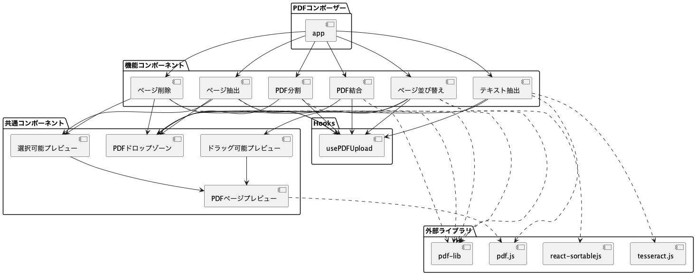
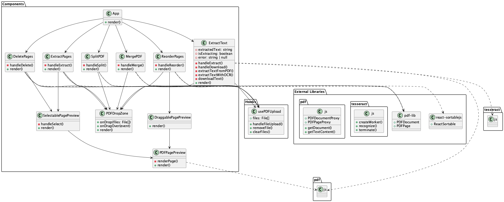
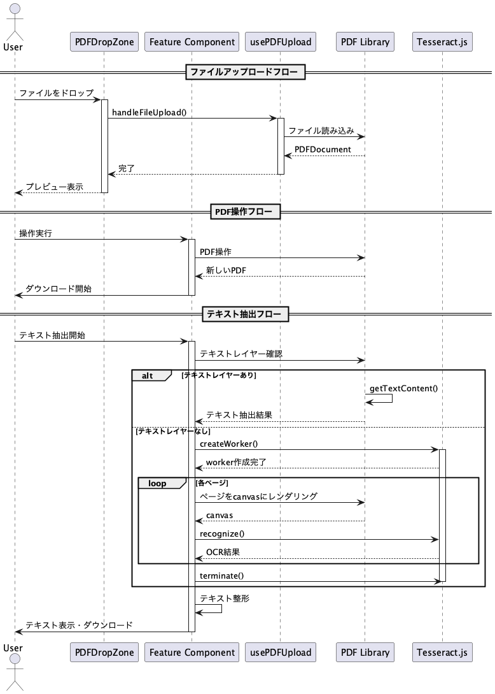

# PDF Composer

PDFファイルを操作するためのWebアプリケーションです。複数のPDFファイルの結合、ページの並び替え、削除、抽出、分割、テキスト抽出などの機能を提供します。

デモサイト: [PDF Composer](https://pdfcomposer.vercel.app)

**重要な特徴**: すべてのPDF処理はクライアントサイド（ブラウザ）で実行され、ファイルがサーバーに送信されることはありません。これにより、以下のメリットがあります：
- プライバシーとセキュリティの保護：機密文書も安心して処理可能
- 高速な処理：ネットワーク転送が不要
- オフライン対応：インターネット接続なしで動作可能

## 機能

- **PDF結合**: 複数のPDFファイルを1つのファイルに結合
- **ページ並び替え**: PDFファイル内のページ順序を変更
- **ページ削除**: 不要なページを削除
- **ページ抽出**: 特定のページを抽出して新しいPDFを作成
- **PDF分割**: PDFファイルを複数のファイルに分割
- **テキスト抽出**: PDFからテキストを抽出（テキストレイヤーがない場合はOCRを使用）

## 技術スタック

- **フロントエンド**: React + TypeScript + Vite
- **UIライブラリ**: TailwindCSS
- **PDF操作**: 
  - pdf-lib: PDFファイルの生成と編集
  - pdf.js: PDFのレンダリングとプレビュー
- **ドラッグ&ドロップ**: react-sortablejs
- **OCR**: tesseract.js

## アプリケーション構成

### コンポーネント図


アプリケーションは以下のパッケージで構成されています：
- 機能コンポーネント（PDF結合、ページ並び替え、テキスト抽出など）
- 共通コンポーネント（PDFドロップゾーン、プレビューなど）
- カスタムフック
- 外部ライブラリ

### クラス図


主要なクラスとその関係を示しています：
- 各機能コンポーネント（MergePDF, ReorderPages, ExtractText など）
- 共通コンポーネント（PDFDropZone, PDFPagePreview など）
- カスタムフック（usePDFUpload）

### シーケンス図


主要な操作フローを示しています：
1. ファイルアップロードフロー
2. PDF操作フロー
3. テキスト抽出フロー

## 動作要件

- **モダンブラウザ**:
  - File System Access API対応
  - Web Workers対応
  - ES6+対応
- **インターネット接続**: 初回読み込み時のみ必要（アプリケーションのダウンロード用）

## インストール

```bash
# リポジトリのクローン
git clone [repository-url]

# 依存パッケージのインストール
cd pdfcomposer
npm install

# 開発サーバーの起動
npm run dev
```

## 使用方法

1. アプリケーションを起動し、ブラウザで http://localhost:5173 にアクセス
2. 必要な機能を選択（結合、並び替え、テキスト抽出など）
3. PDFファイルをドラッグ&ドロップまたはファイル選択
4. 必要な操作を実行
5. 結果のPDFファイルまたはテキストがダウンロードされます

## 開発

### プロジェクト構造

```
pdfcomposer/
├── src/
│   ├── components/     # Reactコンポーネント
│   ├── hooks/         # カスタムフック
│   ├── lib/          # ユーティリティと設定
│   └── App.tsx        # メインアプリケーション
├── materials/         # UMLダイアグラムなど
└── package.json
```

### ビルド

```bash
# プロダクションビルド
npm run build

# ビルドのプレビュー
npm run preview
```

## セキュリティとプライバシー

- すべてのPDF処理はブラウザ内で実行
- ファイルはサーバーにアップロードされない
- Web WorkersによるPDF処理の分離
- ローカルストレージのみを使用（セッション中のみ）

## ライセンス

MIT License
